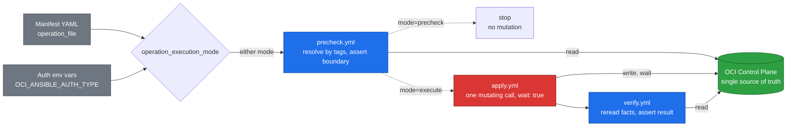

# Customer deployment guide

This is the order to do things in, from an empty runner to a database you have
created and verified. It says what each step is for and links to the document
that covers it in full, so nothing here repeats the installation or
authentication instructions.

Every operation is one `ansible-playbook` command whose `operation_execution_mode`
decides how far it goes. `precheck` always runs; `apply` and `verify` only run
when the mode is `execute`, in the same invocation:



Run the command once with `precheck` and review the evidence; run the exact
same command again with `execute` only after approval. There is no separate
`verify` command — it is the last task of the `execute` run.

## 1. Confirm the OCI boundary

The target compartment and ExaCS VM Cluster must already exist. They may have
been provisioned through the Azure, AWS, or GCP control plane; from that point
on, Database Homes, CDBs, and PDBs are managed through OCI APIs.

The identity the runner uses needs permission on OCI Database resources in that
compartment. Get this right before anything else: an identity that can
authenticate but cannot see the compartment produces a "not found" error, which
reads like a missing resource rather than a missing permission. See
[authentication.md](authentication.md) for the two supported modes and for the
policy the automation needs.

## 2. Install the automation dependencies

Follow [getting-started.md](getting-started.md): a Python 3.12 virtual
environment, Ansible, the OCI SDK, and the pinned `oracle.oci` collection. It
ends with a syntax check that needs no credentials and contacts no OCI service,
which is the right place to stop and confirm the runner is sound.

## 3. Understand the three levels before running anything

Every operation in this repository runs at one of three increasing levels of
commitment:

| Level | Command | Contacts OCI? | Changes anything? |
| --- | --- | --- | --- |
| Syntax check | `--syntax-check` | No | No |
| Precheck | `-e operation_execution_mode=precheck` | Yes, read-only | No |
| Execute | `-e operation_execution_mode=execute` | Yes | Yes |

Always work upwards through those levels. `execute` is the only one that
changes an ExaCS resource.

## 4. Create Database Homes, CDBs, and PDBs

Examples live under `ansible/example/yaml/` and `ansible/example/json/` —
identical content, pick whichever format your tooling prefers. Copy one into
your own protected customer repository, replace fictional infrastructure
boundary OCIDs, and choose stable resource keys and names. Do not commit
passwords; the CDB and PDB examples read them from environment variables.

Organize real manifests under `ansible/manifests/<vm-cluster-name>/`, one
subfolder per VM Cluster, so a change is scoped to one cluster at a glance.
Name each file after the change it represents — `CRQ1042_db-home-create.yml`
if change requests are how your organization tracks this — so the history of
that folder reads as a log of what happened to that cluster, not a file that
gets silently overwritten on every run:

```bash
mkdir -p ansible/manifests/vmcluster-01
cp ansible/example/yaml/db-home-create.example.yml \
  ansible/manifests/vmcluster-01/CRQ1001_db-home-create.yml
cp ansible/example/yaml/cdb-create.example.yml \
  ansible/manifests/vmcluster-01/CRQ1002_cdb-create.yml
cp ansible/example/yaml/pdb-create.example.yml \
  ansible/manifests/vmcluster-01/CRQ1003_pdb-create.yml
```

For each master, run `precheck`, review its OCI evidence, then run `execute`.
For example:

```bash
OCI_ANSIBLE_AUTH_TYPE=instance_principal \
ansible-playbook ansible/playbooks/exacs-db-home-create.yml \
  -e operation_file=$PWD/ansible/manifests/vmcluster-01/CRQ1001_db-home-create.yml \
  -e operation_execution_mode=precheck
```

Use the same command with `operation_execution_mode=execute` after approval.
Create the CDB only after its target Database Home is available; create
additional PDBs only after the CDB is available.

## 5. Discover observed OCI state

Run the read-only discovery master whenever you need an evidence view. It
reports the selected VM Cluster's current capacity, all Database Homes in it,
and the CDBs/PDBs carrying the selected project and environment ownership
tags; it does not maintain an OCID registry.

```bash
ansible-playbook ansible/playbooks/exacs-resource-discovery.yml \
  -e operation_file=$PWD/ansible/manifests/vmcluster-01/resource-discovery.yml
```

## 6. Run a reviewed Day 2 operation

[day2-operations.md](day2-operations.md) is the catalog: what each operation
does, and how far each one has been proven against a real VM Cluster. They all
take the same two arguments and pass the same precheck gate, so the shape of a
Day 2 run is the shape you already know from step 4.

The out-of-place patch is the one with a prerequisite. Create and verify the
compatible target Database Home first, then copy
`ansible/example/yaml/out-of-place-patch.example.yml` and supply the business
keys, display names, compartment, VM Cluster, and target version. Its precheck
validates the
source, the target, the version, the VM Cluster, and the lifecycle state before
anything moves.

Retain the precheck and post-operation output. That output is the run evidence,
and OCI remains the source of observed state.
